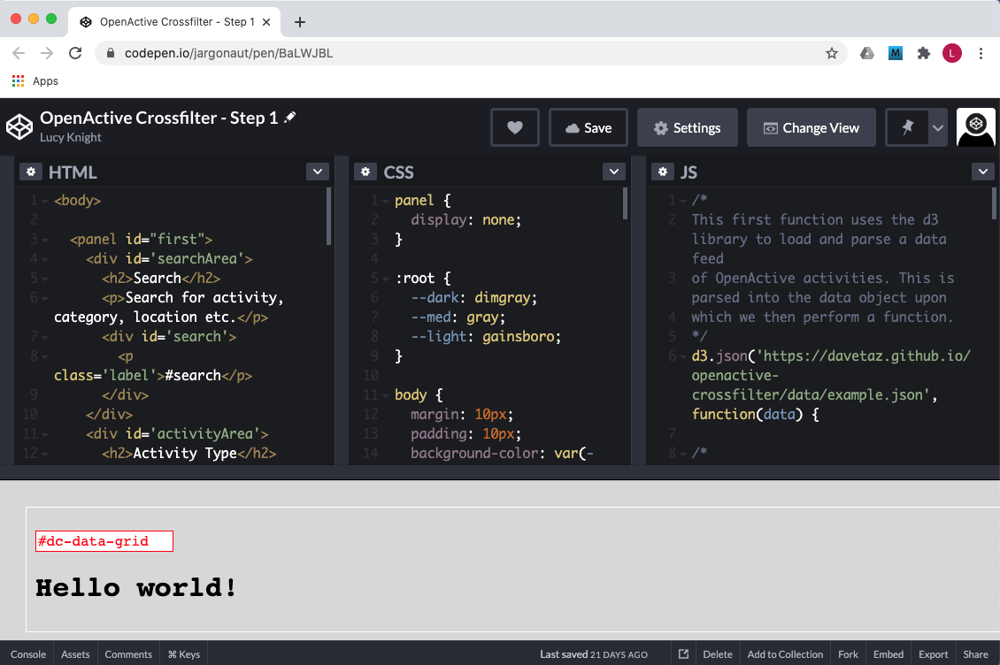
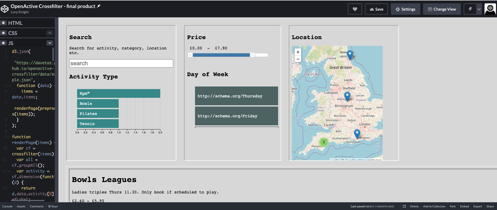

# Steps to learn how to build the cross filter

## Requirements

We'll be using Codepen for this exercise. To get started, check out
[https://codepen.io/jargonaut/pen/BaLWJBL
](https://codepen.io/jargonaut/pen/BaLWJBL). We've already built the boilerplate HTML, Javascript and CSS to get you started.

If you're already familar with Codepen, feel free to go straight to Step 1. But if you haven't used it before, here's how you get started.  

### Open the link
This will take you to the example we've created for you. This is referred to as a 'pen'. Take a few minutes to read through the code and see if you can work out from the comments what we're trying to do in each section.

### Create a CodePen account
This means that any work you do can be saved to your own account.

### Fork a copy of the example
Use the `Fork` button at the bottom right of the page (or use CTLR+S on your keyboard); this creates an exact copy of the pen that you can then make changes to.

### Get familiar with the workspace
  
  

You'll see four main sections: three for code, and one for the output.  

* The HTML section contains the code that builds the web page - page elements, sections, navigation and content blocks.  
*  The CSS section is where your style instructions go, things like which fonts to use, colours for different elements, and the way different parts behave in relation to each other.  
*  Finally the JS (Javascript) section is where you put the code that creates dynamic content - complex functions, data wrangling and calculations. This is the only section you will need to edit (aside from a single small change to the CSS in Step 3) so you can resize or hide the others for now to give you more room to work.

As you edit the code you will see the final section, the output, change in response. By default a pen is set up to refresh automatically as soon as a change is made, but you can explore the settings and change that option if you prefer to refresh manually.

### Make a start!
Now you have your own account and a copy of the example pen to work with, it's time to get started on the exercise.

# Step 1 - getting elements of the dataset
In this step we will look at how to interrogate the data and extract what we need to populate some simple information cards in a grid layout.

### Make a change and see the results

Find the following line of code:

    $('#dc-data-grid').append("<h1>Hello world!</h1>");

This line is what outputs "Hello world!" to the screen. Change this to say `Hello *your-name*`.

It should now say `Hello *your-name*` in the bottom panel.

### Change the code to display activities

Let's make it display the name of our first activity from our data object.

To do this we need to select the first session (`item` in the data object) from all sessions (`items` in the data object). Add this line above the one with your name in it:

    session = items[0];

As a simple example we are going to output just the name of the session. This is contained in the `data.name` variable of the item. To display on the screen, change the line with your name in to the following:

     $('#dc-data-grid').append("<h1>" + session.data.name + "</h1>");

Here we have kept the `h1` tag in order to make it big and bold.  
Everything inside quotes is what gets output, so to include a value from our data, we have to ensure we are not inside quotes and we use the `+` sign to join these outputs together.

---

### Test what you've learned

Try appending the session description inside paragraph `p` tags so it displays under the session name.

---

---

### HELP: It doesn't work

If you get stuck at any time, you might need to look at the debugger which can give you clues as to what is not correct.

You can view this by clicking the "Console" button at the bottom left corner of codePen.

You might get useful messages like, missing quote (did you close all open quotes?), unexpected quote (did you have all the plus signs?), or missing or unexpected brackets (are they all in the right place and in the right order?).

Note: The very last part of the error message (after the colon ":") will tell you what line of code the error is on. e.g. "at https://...../.../...:43" would be line 43.

---

## Step 2 - Display details for more than one session

In this stage we are going to build an iterator. This is a piece of code that loops through every session in the dataset and displays the name and description for each one.

### Add an iterator

To do this replace the line

    session = items[0];

with the following

    items.forEach(function(session) {

This line is similar to the one we have removed, it still contains `items` and `session`. We are using the `forEach` iterator to loop through the sessions.  

Note that we have unclosed brackets `(` and `{` as well as a missing end of code block character `;`. These closing brackets and code block character need to go after we have finished appending the session name and description to the screen.

Add `});` after your code lines that append name and description to the `#dc-data-grid`.

The finished code block should look something like this:

    items.forEach(function(session) {
        $('#dc-data-grid').append('<h1>' + session.data.name + '</h1>');
        $('#dc-data-grid').append("..."); // your code for adding the session description
    });

>**Note:** To make code more human-readable it's a good convention to start a new line after every opening `{` and indent each line that follows (using tab or similar) prior to the closing `}`.

## Step 3 - Starting to build the cross filter.
[https://skyscanner.net](https://skyscanner.net) is a great example of a crossfilter. We are going to make something very similar, but for sessions rather than flights. We will use the list of sessions we built in Step 2 to create our filters.

### Make a list of sessions for our filter

The first step of building our crossfilter is to create a list of sessions that can be filtered. To do this we need to use a few helper functions from the [dc.js](https://dc-js.github.io/dc.js/) library.

> **What is a code library?**
>
> Think of a code library as a set of pre-defined routines and functions that you can use to make your life easier.
> In this tutorial we are using 10 code libraries to help us. We've included a list of them in the References section at the end of this document, and you can also look at them in CodePen by clicking on the Settings (gear wheel) icon at the top of the JS panel.

Comment out the code you added in Step 1 and Step 2. This will stop the code in step 1 and step 2 from working and prepare us to do the same thing in a different way.

> **How do I comment out code?**
>
> This varies from language to language. To comment out a line of code in javascript, you type `//` at the beginning of the line. You will see this in the CodePen where we have put dividers and hints to show where things should go.
> To comment out several lines in one go, type `/*` at the beginning of the block and `*/` at the end.

Find the line that reads

     //STEP 3 CODE GOES HERE

Add the following line below it

    var dataGrid = dc.dataGrid('#dc-data-grid');

This line sets up the dataGrid object as a `dc.dataGrid` and tells it that the grid will be going in the `#dc-data-grid` element on our web page.

At this point your output will change; your list will disappear, and you may see messages telling you that you need to provide an html() handling param. This is the content of the datagrid.

Let's define the content. Add the following line:

    dataGrid
        .html(function(session) {
            return '<item>' + '<h1>' + session.data.name + '</h1>' + '
' + session.data.description + '
' + '</item>';
        });

>**Note:** Here we are not appending, but rather returning a set of things to display for each session in one long line. Some extra tags have been added for style.

Finally, add these lines under `dataGrid`:  

      .dimension(activity)
      .section(function(item) {
        return item.id;
      })
      .size(1000);

These lines do three things:  

* set up the dataGrid to depend on activityName as a key variable,  
* give each item in the grid an ID,  
* limit the number of displayed items on the screen to 1000.

---

### Test what you've learned

Try adding another detail to your dataGrid: the price range that people might need to pay for each session. The OpenActive crossfilter helper library has a function called `getPriceRange()`. To use it, you pass in the `offers` data from each item in your `sessions` data object, like this:  

	getPriceRange(session.data.offers)  

Using the HTML opening and closing tags and '+' as before, see if you can make this display under your session name and details in the data grid. 

---

### Create the activity row chart

Now we need to create a way to filter the dataGrid, in this case a rowChart of activity types. First we need to reveal the hidden structure on our page where the filters are going to be.

In CodePen reveal the `CSS` panel and find the section at the top that reads

    panel {
      display: none;
    }

Change this to

    panel {
      display: inline-block;
    }

This will make several new areas visible on the screen. These areas are where we will put the different filters. Note the ID of each area is shown in red text.

Hide the `CSS` panel and go back to the `JS` panel.

Add the following line of code to set up the rowChart:

    var activityChart = dc.rowChart('#activityChart');

Then configure it:

    activityChart
      .width(400)
      .height(200)
      .dimension(activity)
      .group(activityGroup);

This should display a rowChart of activityTypes on the screen which you can then click on to filter the dataGrid.

**Congratulations! You just built a working cross filter.**

> **The dc-js crossfilter chart types**
>
> There are many types of charts and grids in the dc-js crossfilter library. It can be difficult to get started sometimes, as the documentation doesn't always make it clear what the minimal configuration is to make a chart display. Now you have a basic chart showing up, you can check out the different options and configurations for your rowChart at [http://dc-js.github.io/dc.js/docs/html/](http://dc-js.github.io/dc.js/docs/html/).
>

Now for a basic line chart. Let's get the session cost (price) for each activity and use it to make another facet on our crossfilter.

Add the following lines underneath the code for your activity rowChart:

    // CREATE COST CHART
    var cost = cf.dimension(function(item) {
      price = item.data.offers[0].price;
      return price;
    });

    var costGroup = cost.group();

    var costChart = dc.lineChart('#costChart');

    costChart
      .width(300)
      .height(100)
      .dimension(cost)
      .group(costGroup)
      .x(d3.scaleLinear().domain([0,10]))
      .xUnits(function(){
        return 20;
      });

You should now see a line chart showing the activity cost by number of sessions appearing under the `#costChart` label. It may be a little messy since we haven't done anything with the styling yet, but we can see it working. If you click on any row in the activity chart you should see the cost chart change as the data is filtered.

---
### Test what you've learned

Can you change the cost line chart into a bar chart instead?
>**Hint:**
>The dc.js documentation describes how to create different chart types.

---

## Step 4 - improving the user interface

We have a working crossfilter, but now we need to add a few more elements to make it easier to use.

### Adding a Search function
This will make it easier to filter the data by keyword. You can instruct this function to look in multiple fields within the data to find a match, but we will start with just two:

* title
* description

as these are the free text fields that are most likely to contain the sort of keywords someone might be looking for. Just as we created a list of activities for our dataGrid to display, now we need something very similar for the Search box to work with.

Find the line that reads

    //STEP 4 CODE GOES HERE

and add the following lines of code.

Build a list to search on:  

    var searchText = cf.dimension(function(item) {
      return item.data.name + " " + item.data.description;
    });

Define what we want to show the user - in this case, instead of a `rowChart` or `lineChart` it will be a `textFilterWidget`.

    var search = dc.textFilterWidget("#search");

And finally, we allocate our list of fields - the `searchtext` variable - as a dimension for the crossfilter.

    search.dimension(searchText);

A search box should now be visible under the `#search` label; test it by entering some basic keywords (ones that you know should exist in the data) and making sure it returns the expected results.

---
### Test what you've learned
Look at the sample dataset `example.json` and see whether there are any other fields that might be useful to add to the search function.  
Can you work out how to include them?  
>**Hint:** They need to be part of the `searchText` variable.

---

### Create a slider control
At the moment our crossfilter is showing `cost` as a line chart. It works, but it isn't the most intuitive thing to use as a filter!  Luckily the libraries we are using include another object, the slider, that is commonly used as a filtering element on interactive dashboards. Let's take a look at how we build one.  

We already have costs data, currently feeding into a chart. What we need to do is take that data and pass it to the slider function. This is a little more complex than the charts you've created so far, so you can use the following as a template.  

Add this block under your search function code:  

    // defining min and max prices

    var minPrice = 0;
    var maxPrice = 0;
    var price = cf.dimension(function (d) {
      thisPrice = d.data.offers[0].price;
      if (thisPrice < minPrice) {
        minPrice = thisPrice;
      }
      if (thisPrice > maxPrice) {
        maxPrice = thisPrice;
        $("#costHigh").text("£" + currency(thisPrice));
        $("#costHigh").val(thisPrice);
      }
      return thisPrice;
    });

    // building the slider

    $("#costSlider").slider({
      min: 0,
      max: maxPrice,
      step: 0.5,
      values: [0, maxPrice],
      range: true,
      slide: function (event, ui) {
        $("#costLow").text("£" + currency(ui.values[0]));
        $("#costHigh").text("£" + currency(ui.values[1]));
        $("#costLow").val(ui.values[0]);
        $("#costHigh").val(ui.values[1]);
        if (document.getElementById("costLow").value != "") {
          start = document.getElementById("costLow").value;
        }
        if (document.getElementById("costHigh").value != "") {
          end = document.getElementById("costHigh").value;
        }
        price.filterRange([start, end]);
        dc.redrawAll();
        if (ui.values[0] + 0.1 >= ui.values[1]) {
          return false;
        }
      }
    });
    
You should now see a slider control appear above the `#costSlider` label. Check that it works by changing the price range - it should filter out any activities whose costs fall outside that range.

---
### Test what you've learned

Your crossfilter is starting to get more complex now, with labels and sections leftover from previous steps. Try tidying it up a little.

* Comment out (or delete) the JS and HTML you used to create the Cost line chart.
* Look for other code that's no longer being used. You can decide to keep it if you might want to use it later, or to delete it if you're sure you won't need it.

---

## Step 5 - Add a map

Our sample data includes information where activities are happening, so let's add a map with selectable markers.

First we need to find the location data; let's take a look at the `example.json` file again.  
Each activity has a section called `location` which includes place names, address details and coordinates.

    "location": {
                    "type": "Place",
                    "url": "https://https://www.everyoneactive.com/centre/blackbrook-leisure-centre-spa/",
                    "name": "Blackbrook Leisure Centre",
                    "identifier": "0220",
                    "address": {
                        "type": "PostalAddress",
                        "streetAddress": "Blackbrook Way",
                        "addressLocality": "Taunton",
                        "addressRegion": "Somerset",
                        "postalCode": "TA1 2RW",
                        "addressCountry": "GB"
                    },
                    "geo": {
                        "type": "GeoCoordinates",
                        "latitude": 51.0129,
                        "longitude": -3.07004
                    }
                },

Latitude and longitude coordinates are what we'll use to place markers on our map, so let's extract those first. Add the following code blocks under the line `// STEP 5 CODE GOES HERE`.

    var locations = {};

    var geo = cf.dimension(function (d) {
      if (d.data.location.geo) {
        point = d.data.location.geo.latitude + "," + d.data.location.geo.longitude;
        locations[point] = d.data.location;
        return point;
      } else {
        return "0,0";
      }
    });

    var geoGroup = geo.group();

Next we create the map object:

    var mapChart = dc_leaflet.markerChart("#map");

Then we add some formatting and pass it the data:

    mapChart
    .dimension(geo)
    .group(geoGroup)
    .width(350)
    .height(450)
    .center([53.2, -1.5])
    .zoom(6)
    .cluster(true)
    .popup(function (d) {
      loc = locations[d.key];
      if (loc) {
        return (
          "<h2><a target='_blank' href='" +
          loc.url +
          "'>" +
          loc.name +
          "</a></h2>" +
          "
" +
          loc.address.addressRegion +
          "  " +
          loc.telephone
        );
      } else {
        return "unknown";
      }
    });

Note that we also call in some of the human-readable address information to populate the `popup` tooltip option.

---
### Test what you've learned 
Try adding the full address to the tooltip.

---

## Finished!
The finished crossfilter should look something like this:

 

# References

### Code libraries
Here's the list of all the code libraries we're using to build the crossfilter. Without these, the code in this tutorial would be thousands of lines long!  

`openactive-crossfilter helpers` - Built to support this tutorial, includes the data preprocessor as well as functions to extract data from OpenActive data.

`jquery` - Streamlines javascript code  
>(e.g. `$('#dc-data-grid').append('Hello world')` instead of  `document.getElementById('dc-data-grid').appendChild(document.createTextNode("Hello world"));`  

`jquery-ui` - Visual elements for jquery.  

`dc-js` - Javascript charting library  

`crossfilter` - Crossfilter extensions to dc-js  

`d3` - Data visualisation library  

`leaflet` - Open Street Map support  

`leaflet-markercluster` - Map markers and clustering support  

`dc.leaflet` - Integrates dc-js and leaflet for interactive maps  

`moment.js` - Library to handle dates, times and all funky formats they come in.

You can find how these libraries are included in CodePen by clicking the settings button and clicking `JS`.
As many of the libraries also have associated visual style elements, we also have to include their own stylesheets. These can be found under the `CSS` section of settings in CodePen.
